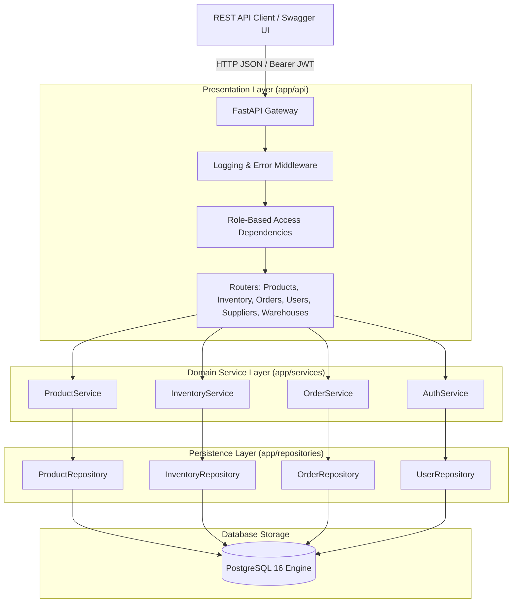
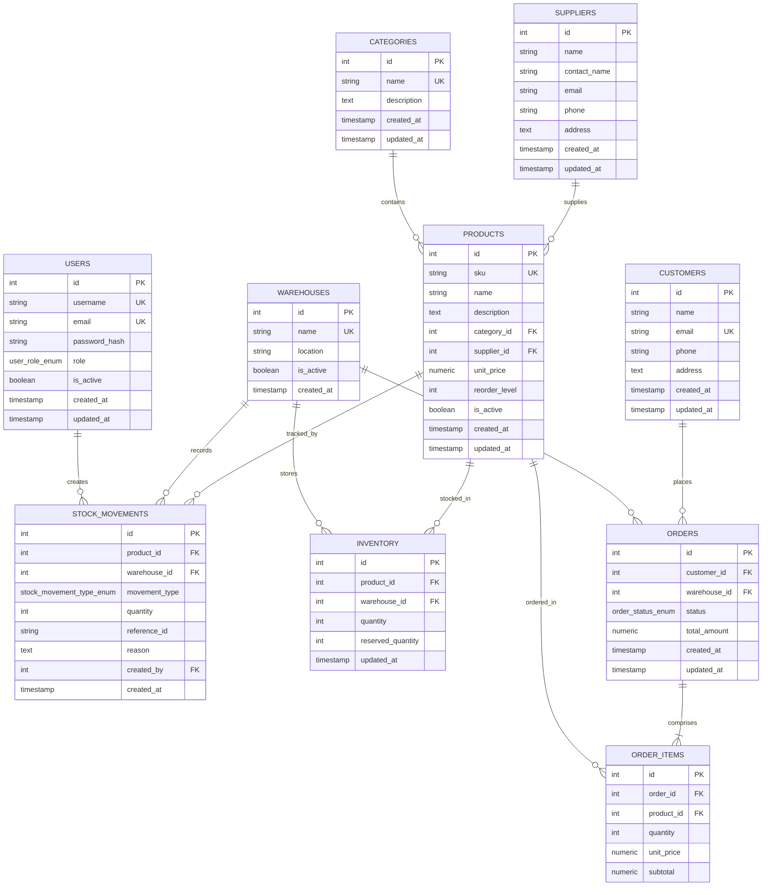
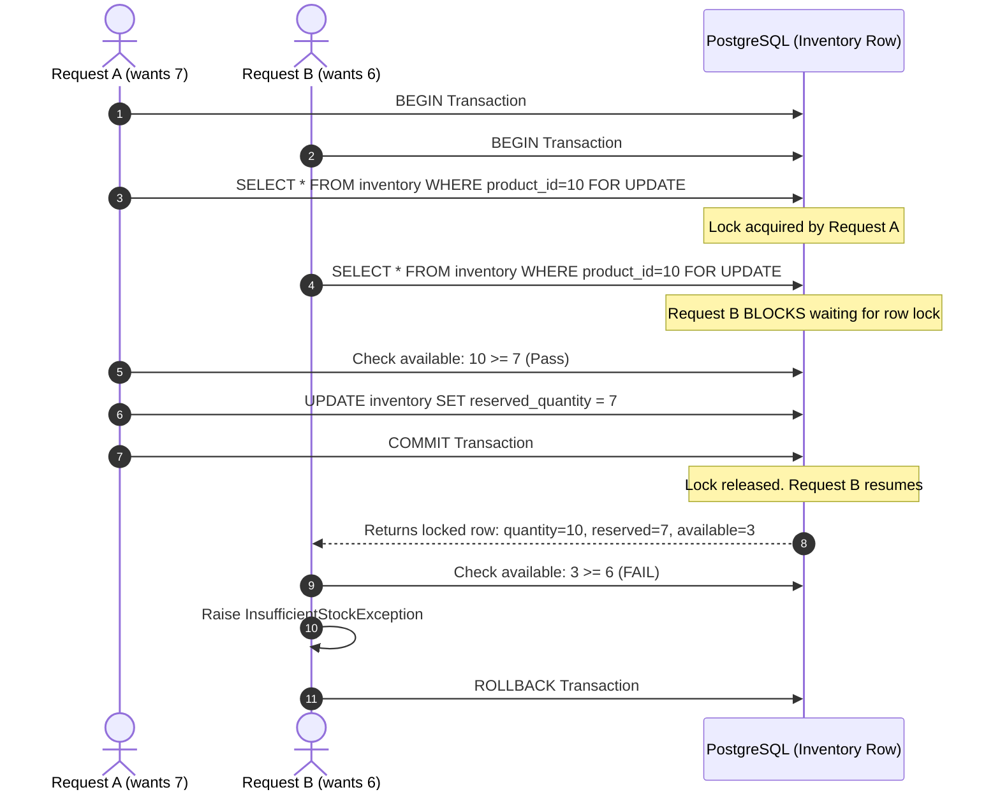
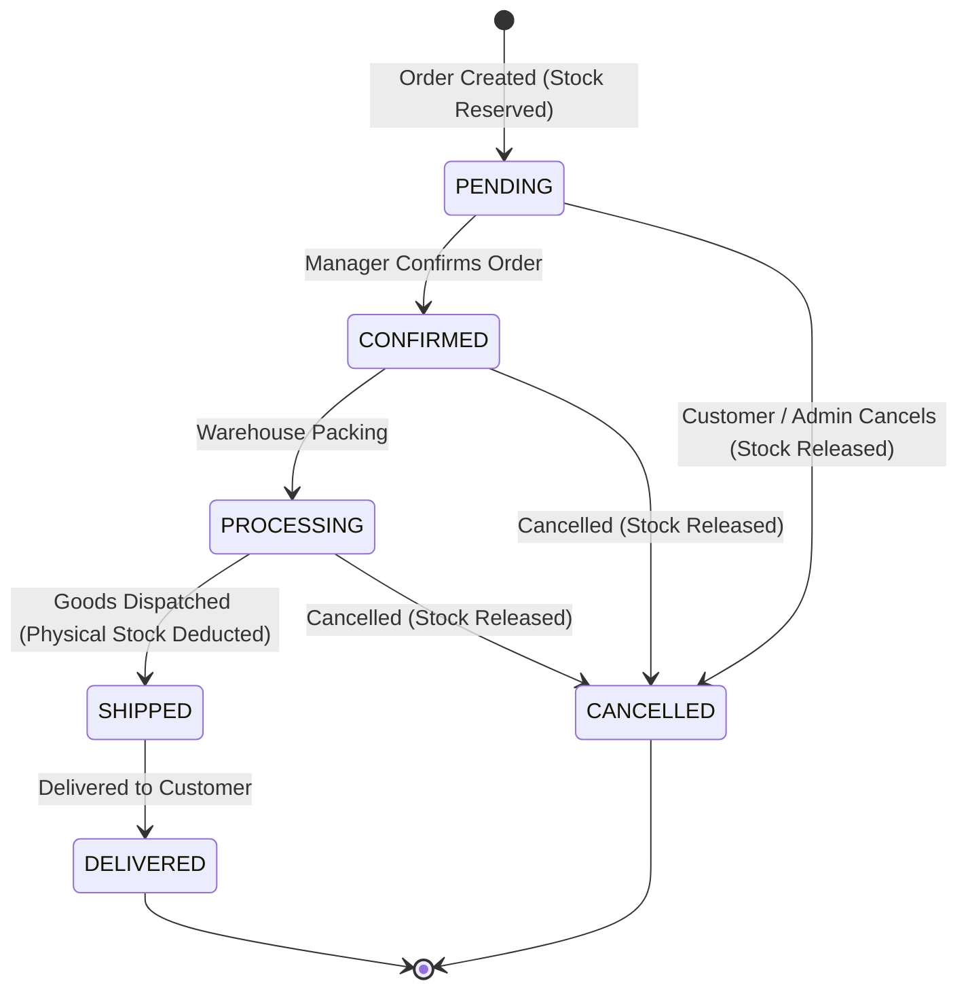

# 📦 Inventory Management System (IMS)

[](https://www.python.org/downloads/)
[](https://fastapi.tiangolo.com)
[](https://www.postgresql.org)
[](https://www.sqlalchemy.org)
[](https://docs.pydantic.dev)
[](https://www.docker.com)
[](LICENSE)

> A production-grade, multi-warehouse inventory management and order processing platform engineered for high-concurrency environments with PostgreSQL row-level locking, strict order lifecycle state transitions, database indexing, and role-based access control.

---

## Table of Contents
1. [Project Overview](#1-project-overview)
2. [Key Features](#2-key-features)
3. [Architecture](#3-architecture)
4. [Technology Stack](#4-technology-stack)
5. [Database Schema & ER Diagram](#5-database-schema--er-diagram)
6. [API Structure](#6-api-structure)
7. [Authentication & Security](#7-authentication--security)
8. [Role-Based Access Control (RBAC)](#8-role-based-access-control-rbac)
9. [Multi-Warehouse Inventory Model](#9-multi-warehouse-inventory-model)
10. [Stock Consistency & Row-Level Locking](#10-stock-consistency--row-level-locking)
11. [Transaction Handling & Atomicity](#11-transaction-handling--atomicity)
12. [Database Indexing Strategy](#12-database-indexing-strategy)
13. [Order Lifecycle & State Transitions](#13-order-lifecycle--state-transitions)
14. [Project Structure](#14-project-structure)
15. [Setup & Installation](#15-setup--installation)
16. [Docker Usage](#16-docker-usage)
17. [Database Migrations (Alembic)](#17-database-migrations-alembic)
18. [Seed Data & Demo Credentials](#18-seed-data--demo-credentials)
19. [Automated Testing Suite](#19-automated-testing-suite)
20. [API Usage & Curl Examples](#20-api-usage--curl-examples)
21. [16-Step Production Demo Walkthrough](#21-16-step-production-demo-walkthrough)
22. [YouTube Video Demo Plan](#22-youtube-video-demo-plan)
23. [Engineering Design Decisions](#23-engineering-design-decisions)
24. [Limitations & Edge Cases Handled](#24-limitations--edge-cases-handled)
25. [Future Roadmap](#25-future-roadmap)

---

## 1. Project Overview

In enterprise logistics and e-commerce fulfillment, basic CRUD operations fail when multiple customers simultaneously order scarce stock or when stock transfers take place across physical facilities.

The **Inventory Management System (IMS)** is built to solve these real-world backend challenges:
- **Warehouse-Specific Stock Allocation**: Eliminates fictitious global inventories by tying stock directly to physical warehouses with independent `quantity` and `reserved_quantity` trackers.
- **Pessimistic Concurrency Control**: Uses PostgreSQL row-level locking (`SELECT ... FOR UPDATE`) to prevent overselling race conditions when concurrent order requests compete for remaining stock.
- **Atomic Multi-Warehouse Transfers**: Guarantees that moving stock between facilities executes as a single ACID transaction with ordered lock acquisition to avoid distributed deadlocks.
- **Immutable Audit Trail**: Every stock change (purchase, manual adjustment, warehouse transfer, or customer sale) generates an append-only `StockMovement` ledger entry.
- **Enforced State Machine**: Order status progresses strictly through `PENDING -> CONFIRMED -> PROCESSING -> SHIPPED -> DELIVERED` (or `CANCELLED`), guaranteeing stock reservations and deductions align with physical warehouse fulfillment.

---

## 2. Key Features

- **JWT Authentication & Passlib Bcrypt**: Secure token-based authentication with expiration handling and SHA-256 bcrypt password hashing.
- **FastAPI Dependency Injection for RBAC**: Granular role enforcement for `ADMIN`, `MANAGER`, and `STAFF` via reusable route dependencies.
- **SQLAlchemy 2.0 ORM & Repository Pattern**: Clean separation of database persistence logic from business domain services.
- **Database-Level Search & Pagination**: Indexed multi-column search (`name`, `SKU`, `description`) and safe SQL-level sorting and pagination (`page`, `page_size <= 100`).
- **Low-Stock Alert Engine**: Real-time aggregation identifying products where `available_quantity <= reorder_level`.
- **System Metrics & Aggregations**: Efficient SQL grouping providing warehouse counts, total inventory units, reserved units, and available capacity.
- **Automated Testing**: 100% passing test suite across unit, service, API, and multi-threaded concurrency scenarios.
- **Containerized Development**: Complete `Dockerfile` and `docker-compose.yml` with health checks and volume persistence.

---

## 3. Architecture

The system adheres to a layered architecture: **Presentation (FastAPI Routers) -> Service Layer (Business Domain & State Machines) -> Repository Layer (SQLAlchemy ORM) -> Database (PostgreSQL)**.



---

## 4. Technology Stack

| Layer / Concern | Technology | Version / Specification | Rationale |
| :--- | :--- | :--- | :--- |
| **Runtime** | Python | 3.12+ | Modern type hinting, native performance optimizations, asyncio |
| **API Framework** | FastAPI | >= 0.110.0 | High-performance ASGI framework with automatic OpenAPI/Swagger generation |
| **Validation** | Pydantic v2 | >= 2.6.4 | Rust-backed blazing-fast request validation and strict serialization |
| **Database Engine**| PostgreSQL | 16-alpine | Enterprise ACID compliance, robust row locking, rich indexing |
| **ORM** | SQLAlchemy | 2.0.28+ | Type-safe declarative models, modern `select()` syntax, fine-grained locking |
| **Migrations** | Alembic | >= 1.13.1 | Deterministic revision control for relational database schemas |
| **Authentication** | PyJWT & Passlib | Bcrypt | Industry-standard JWT access tokens and secure salted hashing |
| **Containerization**| Docker & Docker Compose | Compose v2 | Reproducible container orchestration with health-checked networking |
| **Testing** | Pytest & HTTPX | >= 8.0.0 | Comprehensive unit, integration, and concurrent stress testing |

---

## 5. Database Schema & ER Diagram

The database models 10 distinct entities with strict foreign key constraints, composite indexes, and database-level check constraints.



---

## 6. API Structure

All endpoints reside under the `/api/v1` namespace, logically decoupled into domain routers:

| Router | Path Prefix | Responsibilities |
| :--- | :--- | :--- |
| **Auth** | `/api/v1/auth` | User registration, login, and `/me` profile inspection |
| **Users** | `/api/v1/users` | User administration, role modification, account status |
| **Products** | `/api/v1/products` | Catalog management, database search, active filtering, soft deletion |
| **Categories** | `/api/v1/categories` | Product classification with dependent product safety checks |
| **Suppliers** | `/api/v1/suppliers` | Vendor contact and fulfillment records |
| **Warehouses** | `/api/v1/warehouses`| Distribution hub registration and activation status |
| **Inventory** | `/api/v1/inventory` | Real-time stock levels, manual adjustments, transfers, low-stock alerts, and summary metrics |
| **Orders** | `/api/v1/orders` | Order creation with stock reservation, status transitions, and cancellations |
| **Customers** | `/api/v1/customers` | Customer profile management |

---

## 7. Authentication & Security

1. **Password Hashing**: Plaintext passwords are never stored. Passwords are salted and hashed using **Bcrypt** (`passlib[bcrypt]`).
2. **JWT Access Tokens**:
   - Encoded with HMAC-SHA256 (`HS256`).
   - Token payload contains:
     - `sub`: User ID (subject)
     - `role`: User role (`ADMIN`, `MANAGER`, `STAFF`)
     - `iat`: Timestamp of issuance
     - `exp`: Expiration timestamp (default: 60 minutes)
3. **HTTP Bearer Dependency**:
   - `get_current_user` extracts the `Authorization: Bearer <token>` header.
   - Rejects missing, invalid, or expired tokens with `HTTP 401 Unauthorized`.
   - Confirms user existence and verifies `is_active == True`.

---

## 8. Role-Based Access Control (RBAC)

The system enforces permissions using FastAPI dependency injection (`require_roles(*roles)`):

```python
# app/api/dependencies.py
def require_roles(*allowed_roles: UserRole):
    def role_verifier(current_user: User = Depends(get_current_user)) -> User:
        if current_user.role not in allowed_roles:
            raise ForbiddenException(f"Operation forbidden for role '{current_user.role.value}'")
        return current_user
    return role_verifier
```

### Permission Matrix

| Capability / Endpoint Group | ADMIN | MANAGER | STAFF |
| :--- | :---: | :---: | :---: |
| User Management (`/api/v1/users`) | ✅ | ❌ (403) | ❌ (403) |
| Create / Edit Products & Categories | ✅ | ✅ | ❌ (403) |
| Soft Delete Products | ✅ | ❌ (403) | ❌ (403) |
| View / Search Products Catalog | ✅ | ✅ | ✅ |
| Manage Suppliers & Warehouses | ✅ | ✅ | ❌ (403) |
| Manual Stock Adjustments (`/adjust`) | ✅ | ✅ | ❌ (403) |
| Warehouse Transfers (`/transfer`) | ✅ | ✅ | ❌ (403) |
| View Inventory Levels & History | ✅ | ✅ | ✅ |
| View Inventory Summary Metrics | ✅ | ✅ | ❌ (403) |
| Create Customer Orders | ✅ | ✅ | ✅ |
| Confirm / Ship / Deliver Orders | ✅ | ✅ | ❌ (403) |
| Cancel Eligible Orders | ✅ | ✅ | ✅ |

---

## 9. Multi-Warehouse Inventory Model

Unlike simple e-commerce applications that store a single integer column on the product table, this system models physical logistics:

1. **Multi-Location Inventory**:
   - Inventory is stored in an `inventory` table with a composite unique constraint on `(product_id, warehouse_id)`.
2. **Available vs. Reserved Stock**:
   $$	ext{available\_quantity} = 	ext{quantity} - 	ext{reserved\_quantity}$$
   - `quantity`: Physical units physically present in the warehouse.
   - `reserved_quantity`: Units allocated to open customer orders (`PENDING`, `CONFIRMED`, `PROCESSING`).
   - Available stock represents what is legally orderable or transferable.
3. **Database Constraints**:
   - `CheckConstraint("quantity >= 0")`
   - `CheckConstraint("reserved_quantity >= 0")`
   - `CheckConstraint("quantity >= reserved_quantity")`

---

## 10. Stock Consistency & Row-Level Locking

### The Concurrency Problem
Consider an inventory row with:
- `quantity = 10`
- `reserved_quantity = 0`
- `available_quantity = 10`

If two concurrent HTTP requests arrive at the same millisecond:
- **Request A** wants to order 7 units.
- **Request B** wants to order 6 units.

Without concurrency control (or with naive read-then-write), both transactions read `available = 10`. Both transactions pass the stock check and both write updates, causing total reserved quantity to become 13 — an illegal oversell of 3 units!

### The Solution: Pessimistic Locking with `SELECT ... FOR UPDATE`

```python
# In InventoryRepository
stmt = select(Inventory).where(
    Inventory.product_id == product_id,
    Inventory.warehouse_id == warehouse_id
).with_for_update()
inv = db.execute(stmt).scalar_one_or_none()
```



1. **Row Serialization**: The first request acquires an exclusive lock on the specific inventory row.
2. **Immediate Visibility**: When the second request acquires the lock, it reads the freshly committed values, detecting that available stock is insufficient.
3. **Deadlock Prevention**: When an order contains multiple products or a warehouse transfer involves two warehouses, resources are locked in strictly ascending ID order (`sorted(ids)`), eliminating circular wait deadlocks.

---

## 11. Transaction Handling & Atomicity

All multi-step operations execute inside atomic database transactions:

### Warehouse-to-Warehouse Transfer
1. Validate both source and destination warehouses are active.
2. Sort warehouse IDs: `wh_first, wh_second = sorted([src_id, dst_id])`.
3. Lock source and destination inventory rows.
4. Verify source warehouse has sufficient `available_quantity >= transfer_quantity`.
5. Deduct quantity from source warehouse: `src_inv.quantity -= qty`.
6. Add quantity to destination warehouse: `dst_inv.quantity += qty`.
7. Insert `TRANSFER_OUT` stock movement record.
8. Insert `TRANSFER_IN` stock movement record.
9. Commit transaction. If any check fails, everything rolls back.

### Order Fulfillment & Cancellation
- **Order Creation**: Stock is reserved (`reserved_quantity += qty`). Physical stock remains in warehouse.
- **Order Cancellation**: Reservation is released (`reserved_quantity -= qty`).
- **Order Shipment**: Physical stock departs warehouse (`quantity -= qty`, `reserved_quantity -= qty`) and `SALE` movement is recorded.

---

## 12. Database Indexing Strategy

Every index in the database is intentionally designed to accelerate specific production query patterns:

| Table | Index Name | Columns | Index Type | Query Accelerated & Rationale |
| :--- | :--- | :--- | :--- | :--- |
| `users` | `ix_users_username` | `username` | B-Tree (Unique) | O(1) user lookup during login and registration uniqueness checks. |
| `users` | `ix_users_email` | `email` | B-Tree (Unique) | O(1) email login and duplicate account prevention. |
| `products` | `ix_products_sku` | `sku` | B-Tree (Unique) | Rapid SKU scanning in inventory operations and barcode integrations. |
| `products` | `ix_products_name` | `name` | B-Tree | Prefix and equality searches on product names. |
| `products` | `ix_products_active_price` | `(is_active, unit_price)` | Composite B-Tree | High-throughput e-commerce catalog filtering: queries selecting active items sorted by price. |
| `products` | `ix_products_category_active`| `(category_id, is_active)`| Composite B-Tree | Department navigation: browsing active products in a category without full table scans. |
| `inventory` | `uq_inventory_product_warehouse` | `(product_id, warehouse_id)` | Composite Unique | Guarantees single inventory record per product-warehouse pair; accelerates `SELECT FOR UPDATE`. |
| `inventory` | `ix_inventory_wh_prod` | `(warehouse_id, product_id)` | Composite B-Tree | Instant filtering of all products stored in a specific warehouse facility. |
| `stock_movements` | `ix_stock_movements_prod_time` | `(product_id, created_at)` | Composite B-Tree | Historical audit log queries: chronological ledger of movements for a product. |
| `stock_movements` | `ix_stock_movements_wh_time` | `(warehouse_id, created_at)` | Composite B-Tree | Warehouse activity logs: viewing facility throughput over time. |
| `orders` | `ix_orders_status_created` | `(status, created_at)` | Composite B-Tree | Order fulfillment dashboards querying orders in `PENDING` or `PROCESSING` sorted by date. |
| `orders` | `ix_orders_cust_created` | `(customer_id, created_at)` | Composite B-Tree | Customer order history pagination without sorting overhead. |
| `order_items` | `ix_order_items_order_prod` | `(order_id, product_id)` | Composite B-Tree | Fast join resolution when loading items for an order. |

---

## 13. Order Lifecycle & State Transitions

The system implements an explicit finite state machine:



- Disallowed transitions (e.g. `PENDING -> DELIVERED` or `DELIVERED -> CANCELLED`) are rejected with `HTTP 400 Bad Request`.

---

## 14. Project Structure

```text
inventory-management-system/
├── app/
│   ├── __init__.py
│   ├── main.py                          # FastAPI app instance, middlewares & exception handlers
│   │
│   ├── api/
│   │   ├── __init__.py
│   │   ├── dependencies.py              # JWT authentication & RBAC role verifiers
│   │   └── v1/
│   │       ├── __init__.py
│   │       ├── router.py                # Consolidated v1 router
│   │       └── endpoints/
│   │           ├── __init__.py
│   │           ├── auth.py              # Register, login, me
│   │           ├── users.py             # User CRUD & role admin
│   │           ├── products.py          # Product catalog & search
│   │           ├── categories.py        # Category management
│   │           ├── suppliers.py         # Vendor management
│   │           ├── warehouses.py        # Warehouse facilities
│   │           ├── inventory.py         # Stock adjust, transfer, low-stock, metrics
│   │           ├── orders.py            # Order lifecycle endpoints
│   │           └── customers.py         # Customer records
│   │
│   ├── core/
│   │   ├── __init__.py
│   │   ├── config.py                    # Pydantic v2 Settings from environment
│   │   ├── security.py                  # JWT & Bcrypt password hashing
│   │   ├── logging.py                   # Structured console logging
│   │   └── exceptions.py                # Domain exception definitions
│   │
│   ├── db/
│   │   ├── __init__.py
│   │   ├── base.py                      # SQLAlchemy 2.0 Base & TimestampMixin
│   │   └── session.py                   # Database engine & connection pooling
│   │
│   ├── models/                          # SQLAlchemy 2.x Declarative ORM models
│   │   ├── __init__.py
│   │   ├── user.py
│   │   ├── category.py
│   │   ├── supplier.py
│   │   ├── warehouse.py
│   │   ├── product.py
│   │   ├── inventory.py
│   │   ├── stock_movement.py
│   │   ├── customer.py
│   │   ├── order.py
│   │   └── order_item.py
│   │
│   ├── schemas/                         # Pydantic v2 validation models
│   │   ├── __init__.py
│   │   ├── auth.py
│   │   ├── user.py
│   │   ├── category.py
│   │   ├── supplier.py
│   │   ├── warehouse.py
│   │   ├── product.py
│   │   ├── inventory.py
│   │   ├── stock_movement.py
│   │   ├── customer.py
│   │   └── order.py
│   │
│   ├── repositories/                    # Database query abstraction
│   │   ├── __init__.py
│   │   ├── user_repository.py
│   │   ├── category_repository.py
│   │   ├── supplier_repository.py
│   │   ├── warehouse_repository.py
│   │   ├── product_repository.py
│   │   ├── inventory_repository.py
│   │   ├── order_repository.py
│   │   └── customer_repository.py
│   │
│   ├── services/                        # Business domain logic
│   │   ├── __init__.py
│   │   ├── auth_service.py
│   │   ├── user_service.py
│   │   ├── product_service.py
│   │   ├── inventory_service.py
│   │   └── order_service.py
│   │
│   └── utils/
│       ├── __init__.py
│       ├── enums.py                     # Enums for Roles, OrderStatus, MovementType
│       └── pagination.py                # Generic pagination helper
│
├── tests/                               # Comprehensive Pytest suite
│   ├── __init__.py
│   ├── conftest.py                      # Test fixtures & in-memory SQLite engine
│   ├── api/
│   │   ├── test_auth.py                 # Registration & JWT verification
│   │   ├── test_products.py             # Product search & RBAC
│   │   ├── test_inventory.py            # Stock adjustments & transfers
│   │   └── test_orders.py               # Order state machine & reservation
│   ├── services/
│   │   ├── test_inventory_service.py    # Service domain logic
│   │   └── test_order_service.py        # Order transitions & stock checks
│   └── integration/
│       ├── test_stock_concurrency.py    # Multi-threaded row locking stress test
│       └── test_order_transaction.py    # Multi-item order atomic rollback
│
├── alembic/                             # Alembic migrations
│   ├── env.py
│   ├── script.py.mako
│   └── versions/
│       └── 001_initial_schema.py        # Full initial schema migration
│
├── scripts/
│   └── seed_data.py                     # Initial demo dataset seeding
│
├── Dockerfile                           # Multi-stage Python 3.12 container
├── docker-compose.yml                   # PostgreSQL + FastAPI orchestrated stack
├── .dockerignore
├── .env.example
├── .gitignore
├── alembic.ini
├── pyproject.toml                       # Build & dependency specifications
├── Makefile                             # Convenient orchestration shortcuts
└── README.md                            # Complete engineering documentation
```

---

## 15. Setup & Installation

### Prerequisites
- Docker & Docker Compose **OR** Python 3.12+ and PostgreSQL 16 installed locally.

### Local Development (without Docker)
1. **Clone repository**:
   ```bash
   git clone <repo-url>
   cd inventory-management-system
   ```

2. **Create and activate virtual environment**:
   ```bash
   python3 -m venv venv
   source venv/bin/activate
   ```

3. **Install dependencies**:
   ```bash
   pip install -e ".[dev]"
   ```

4. **Configure environment**:
   ```bash
   cp .env.example .env
   # Update DATABASE_URL with local Postgres credentials
   ```

5. **Run database migrations**:
   ```bash
   alembic upgrade head
   ```

6. **Seed demo data**:
   ```bash
   python scripts/seed_data.py
   ```

7. **Launch API server**:
   ```bash
   uvicorn app.main:app --host 0.0.0.0 --port 8000 --reload
   ```
   Open `http://localhost:8000/docs` in your browser.

---

## 16. Docker Usage

The fastest way to launch the full PostgreSQL + FastAPI stack:

```bash
# 1. Build and run containers in background
docker compose up --build -d

# 2. View streaming logs
docker compose logs -f api

# 3. Stop containers
docker compose down
```

The `docker-compose.yml` service automatically waits for the PostgreSQL health check, applies Alembic migrations, runs `seed_data.py`, and launches Uvicorn on port `8000`.

---

## 17. Database Migrations (Alembic)

```bash
# Run migrations to latest schema
alembic upgrade head

# Rollback one migration
alembic downgrade -1

# Generate a new auto-detected migration
alembic revision --autogenerate -m "add_custom_field"
```

---

## 18. Seed Data & Demo Credentials

The database comes pre-populated with realistic inventory, products, suppliers, warehouses, and users:

| Role | Username | Email | Password |
| :--- | :--- | :--- | :--- |
| **ADMIN** | `admin` | `admin@inventory.io` | `AdminPassword123!` |
| **MANAGER** | `manager` | `manager@inventory.io` | `ManagerPassword123!` |
| **STAFF** | `staff` | `staff@inventory.io` | `StaffPassword123!` |

---

## 19. Automated Testing Suite

The project includes unit, service, API, and integration concurrency tests:

```bash
# Run full test suite
pytest tests/ -v

# Run concurrency stress tests only
pytest tests/integration/test_stock_concurrency.py -v
```

### Concurrency Stress Test Verification
The integration test `test_stock_concurrency.py` sets up a product with 10 units in stock. It spawns two concurrent threads in a `ThreadPoolExecutor`:
- **Thread 1** requests 7 units.
- **Thread 2** requests 6 units.
Total requested: 13 units.

**Test Assertions:**
- Exactly one thread receives `HTTP 201 Created`.
- Exactly one thread receives `InsufficientStockException`.
- Database verification confirms final `reserved_quantity == 7` (or `6`), never `13`. Available stock remains `>= 0`.

---

## 20. API Usage & Curl Examples

### 1. Authenticate & Obtain Token
```bash
curl -X POST "http://localhost:8000/api/v1/auth/login" \
  -H "Content-Type: application/json" \
  -d '{"username_or_email": "admin", "password": "AdminPassword123!"}'
```
Response:
```json
{
  "access_token": "eyJhbGciOiJIUzI1NiIsInR5cCI6IkpXVCJ9...",
  "token_type": "bearer",
  "expires_in": 3600,
  "user_id": 1,
  "username": "admin",
  "role": "ADMIN"
}
```

### 2. Search Products
```bash
curl -X GET "http://localhost:8000/api/v1/products/search?q=keyboard&page=1&page_size=10" \
  -H "Authorization: Bearer <TOKEN>"
```

### 3. Transfer Stock Between Warehouses
```bash
curl -X POST "http://localhost:8000/api/v1/inventory/transfer" \
  -H "Authorization: Bearer <TOKEN>" \
  -H "Content-Type: application/json" \
  -d '{
    "product_id": 1,
    "source_warehouse_id": 1,
    "destination_warehouse_id": 2,
    "quantity": 25
  }'
```

### 4. Create an Order (Reserving Stock)
```bash
curl -X POST "http://localhost:8000/api/v1/orders" \
  -H "Authorization: Bearer <TOKEN>" \
  -H "Content-Type: application/json" \
  -d '{
    "customer_id": 1,
    "warehouse_id": 1,
    "items": [{"product_id": 1, "quantity": 5}]
  }'
```

### 5. Check Low Stock Items
```bash
curl -X GET "http://localhost:8000/api/v1/inventory/low-stock" \
  -H "Authorization: Bearer <TOKEN>"
```

---

## 21. 16-Step Production Demo Walkthrough

Follow these steps for technical interviews or video recordings:

1. **Start System**: Run `docker compose up --build -d`.
2. **Open Swagger Docs**: Visit `http://localhost:8000/docs`.
3. **Login as Admin**: Call `POST /api/v1/auth/login` with `admin` / `AdminPassword123!`. Copy token and click **Authorize** in Swagger.
4. **Create Product**: Call `POST /api/v1/products` with SKU `KB-PRO-99`, name `Pro Wireless Keyboard`, unit price `120.00`.
5. **Inspect Warehouses**: Call `GET /api/v1/warehouses` to view `Warehouse A` (ID 1) and `Warehouse B` (ID 2).
6. **Add Stock**: Call `POST /api/v1/inventory/adjust` with product ID, warehouse 1, quantity `100`, reason `"Initial Stock"`.
7. **Query Inventory**: Call `GET /api/v1/inventory/{product_id}`. Show Warehouse 1 has 100 units.
8. **Transfer Stock**: Call `POST /api/v1/inventory/transfer` moving `25` units from Warehouse 1 to Warehouse 2. Show Warehouse 1 now has 75 units and Warehouse 2 has 25 units.
9. **Create Order**: Call `POST /api/v1/orders` for `5` units from Warehouse 1. Show order is `PENDING`, available stock drops to `70` (75 quantity - 5 reserved).
10. **Confirm Order**: Call `POST /api/v1/orders/{order_id}/confirm`. Show status changes to `CONFIRMED`.
11. **Ship Order**: Call `POST /api/v1/orders/{order_id}/ship`. Show status changes to `SHIPPED`. Physical stock decreases from `75` to `70`, and reserved stock resets to `0`.
12. **Deliver Order**: Call `POST /api/v1/orders/{order_id}/deliver`. Show final status `DELIVERED`.
13. **Attempt Excessive Order**: Try creating an order for `1000` units. Demonstrate `HTTP 409 Conflict` with meaningful error: `"Insufficient stock"`.
14. **Demonstrate RBAC**: Login as `staff` (`StaffPassword123!`). Attempt calling `POST /api/v1/inventory/adjust`. Observe `HTTP 403 Forbidden`.
15. **Low-Stock Detection**: Call `GET /api/v1/inventory/low-stock`. Observe items with `available_quantity <= reorder_level`.
16. **Audit Trail**: Call `GET /api/v1/inventory/movements`. Show complete chronological ledger (`PURCHASE`, `TRANSFER_OUT`, `TRANSFER_IN`, `SALE`).

---

## 22. YouTube Video Demo Plan

| Timestamp | Topic | Demo Content |
| :--- | :--- | :--- |
| **0:00 - 0:30** | Project Overview | Problem statement, concurrency risks in inventory, architectural goals |
| **0:30 - 1:30** | Architecture & Stack | Layered design, PostgreSQL ER diagram, row-level locking concept |
| **1:30 - 2:00** | Docker Startup | `docker compose up --build`, health check verification, startup migrations |
| **2:00 - 2:30** | Swagger API | Interactive documentation, schema exploration |
| **2:30 - 3:00** | Authentication & RBAC | JWT login as Admin, Manager, and Staff; 403 Forbidden demonstration |
| **3:00 - 4:00** | Product & Inventory | Creating products, adjusting stock per warehouse, audit log generation |
| **4:00 - 5:00** | Warehouse Transfer | Atomic stock transfer between warehouses with dual ledger entries |
| **5:00 - 6:00** | Order Lifecycle | Full state transition: PENDING -> CONFIRMED -> PROCESSING -> SHIPPED -> DELIVERED |
| **6:00 - 7:00** | Insufficient Stock & Rollback | Handling stock scarcity and multi-item order transaction rollback |
| **7:00 - 8:30** | Concurrency Stress Test | Running `pytest tests/integration/test_stock_concurrency.py` explaining `SELECT FOR UPDATE` |
| **8:30 - 9:00** | Wrap-up | Resume highlights, GitHub repository walkthrough |

---

## 23. Engineering Design Decisions

1. **Why Pessimistic Locking (`SELECT FOR UPDATE`) over Optimistic Locking?**
   - In high-velocity inventory and flash sales, optimistic locking (version column) causes high transaction abort and retry rates when multiple clients contest the same SKU. Pessimistic row locking cleanly serializes workers at the database engine level with minimal overhead.
2. **Why Soft Deletes on Products?**
   - Deleting a product hard-deletes foreign key references in order items and stock movements, compromising historical financial reporting. Marking `is_active = False` preserves referential integrity.
3. **Why Pydantic v2?**
   - Pydantic v2 is implemented in Rust, offering up to 20x faster serialization and validation performance, essential for high-throughput endpoints.
4. **Why Repository Pattern?**
   - Decouples FastAPI route handlers from database query mechanics, enabling modular unit testing and future persistence swaps.

---

## 24. Limitations & Edge Cases Handled

- **Deadlock Prevention**: Always acquires locks on multiple inventory rows in sorted order by `product_id` or `warehouse_id`.
- **Negative Stock Prevention**: Triply guarded via Pydantic validators, service-layer checks, and database-level `CHECK (quantity >= 0)` constraints.
- **Sensitive Data Exposure**: Password hashes and secret tokens are excluded from all schemas and logging middleware.
- **Self-Transfer Prevention**: Explicitly disallows warehouse-to-same-warehouse transfers.

---

## 25. Future Roadmap

- Redis-based caching for high-frequency product catalog reads.
- Celery / background worker tasks for asynchronous email dispatch upon order shipment.
- Webhook notifications for third-party logistics (3PL) integrations.
- Multi-currency support for international orders.

---

## License

Distributed under the MIT License. See `LICENSE` for more information.
